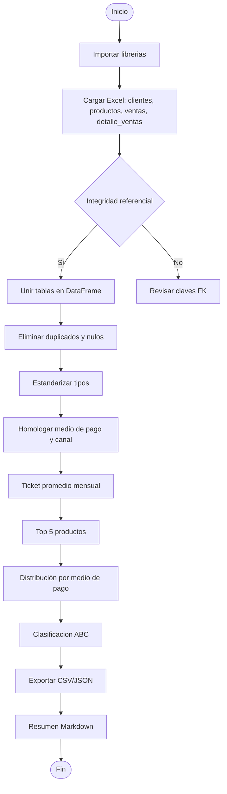

# Proyecto Aurelion – Documentación

---

## 1. Tema

Análisis avanzado de ventas en Minimarket Aurelion, integrando datos de clientes, productos y transacciones para:

* Detectar **productos estrella** y su impacto en el negocio.
* Identificar patrones de **estacionalidad** y tendencias mensuales.
* Analizar el comportamiento de compra por **canal de venta** y  **medio de pago** .
* Segmentar clientes y productos mediante el **teorema de Pareto (ABC 80/20)** para priorizar esfuerzos comerciales.
* Anticipar el abandono de clientes y proponer estrategias de retención.
* Generar reportes automáticos y reproducibles con métricas clave, visualizaciones y hallazgos accionables.

El objetivo es proveer una solución integral y escalable que permita a la tienda tomar decisiones informadas, optimizar recursos y mejorar la rentabilidad, apoyándose en buenas prácticas de ingeniería de datos y analítica de negocio.

---

## 2. Problema

Minimarket Aurelion enfrenta varios desafíos clave:

- No logra identificar de manera oportuna qué productos potenciar en cada canal de venta, perdiendo oportunidades de maximizar ingresos.
- Carece de herramientas para anticipar el abandono de clientes y diseñar estrategias de retención efectivas.
- No clasifica sus productos ni clientes bajo el enfoque ABC (Pareto 80/20), dificultando la priorización de esfuerzos en los segmentos que generan mayor valor.
- La falta de integración y análisis de datos impide detectar patrones de estacionalidad, cambios en el comportamiento de compra y oportunidades de optimización.
- La toma de decisiones se basa en intuición y experiencia, en lugar de información objetiva y métricas confiables.

Estos problemas limitan el crecimiento, la rentabilidad y la capacidad de respuesta del minimarket ante los cambios del mercado.

---

## 3. Solución (hipótesis)

Desarrollar un **pipeline automatizado y reproducible en Python** que permita a Minimarket Aurelion transformar sus datos en información accionable y confiable. La solución propuesta contempla:

1. **Ingesta e integración inteligente**

- Lectura y unión de los archivos `clientes.xlsx`, `productos.xlsx`, `ventas.xlsx` y `detalle_ventas.xlsx` por las claves relevantes (`id_cliente`, `id_producto`, `id_venta`).
- Parametrización flexible por rutas y periodo de análisis (ejemplo: últimos 12 meses) mediante un archivo de configuración centralizado.

2. **Calidad y estandarización de datos**

- Normalización de tipos (`fecha`, numéricos), deduplicación y validación de campos obligatorios.
- Homologación de valores en `medio_pago` (`tarjeta`, `qr`, `transferencia`, `efectivo`).
- Registro de logs detallados sobre filas descartadas y advertencias de calidad.

3. **Cálculo automatizado de métricas clave**

- Ticket promedio mensual.
- Top 5 productos por mes (en monto y unidades).
- Participación por medio de pago y canal de venta.
- Análisis de estacionalidad y tendencias mensuales.
- Clasificación ABC (Pareto 80/20) para productos y clientes, priorizando los segmentos de mayor valor.
- Cálculo de ratios y rankings por categoría y medio de pago.

4. **Exportación y documentación de resultados**

- Generación automática de archivos CSV/JSON (`out_top5.csv`, `out_mediopago.csv`, `out_abc_productos.csv`, `out_abc_clientes.csv`, opcionalmente `out_ratio.csv`).
- Creación de reportes en Markdown (`docs/resumen_mensual.md`) con KPIs, visualizaciones y hallazgos relevantes.

Esta solución busca escalar fácilmente, facilitar la toma de decisiones basada en datos y optimizar los recursos del minimarket, integrando buenas prácticas de ingeniería y analítica de negocio.

* Diagramas **Mermaid** del flujo y del programa en `Documentacion.md`.

5. **Interfaz y uso**

* Script **interactivo** por consola (menú) para ejecutar cada análisis o todo el pipeline.
* Preparado para correr en **VS Code** y en tareas programadas (idempotente).

6. **ML – Sprint 2 (churn)**

* Construye **features RFM** (recency, frequency, monetary), mix por `medio_pago` y categorías.
* Entrena un modelo base (Regresión Logística / RF) con **split temporal** y reporte de métricas.
* Exporta `data/scoring_clientes.csv` con `prob_churn` y  **segmento de riesgo** .

---

## 4. Datos

**Volumen anterior:**

- Productos: 100
- Clientes: 100
- Ventas: 120
- Detalles de ventas: 120

**Volumen actual (tras el cambio):**

- Productos: 125
- Clientes: 1000
- Ventas: 10000
- Detalles de ventas: 10000

El incremento en el volumen de datos permite realizar análisis más robustos, simular escenarios comerciales más realistas y obtener resultados más representativos para la toma de decisiones y el desarrollo de modelos de IA.

**Fuente principal:** Archivos Excel subidos por Minimarket Aurelion.

**Tablas y estructura de datos:**

1. **Clientes**

- `id_cliente` (int, PK): Identificador único de cliente.
- `nombre_cliente` (str): Nombre y apellido.
- `email` (str): Correo de contacto.
- `ciudad` (str): Ubicación geográfica.
- `fecha_alta` (date): Fecha de alta en el sistema.
- **Volumen actual:** 1000 clientes en el dataset simulado. Crecimiento esperado: +5% mensual.

2. **Productos**

- `id_producto` (int, PK): Identificador único de producto.
- `nombre_producto` (str): Nombre comercial.
- `categoria` (str): Rubro (ej.: alimentos, limpieza).
- `precio_unitario` (float): Precio de lista.
- `popularidad` (float): Peso relativo de selección en simulación (la suma del catálogo es 1.0).
- **Volumen actual:** 125 productos. Catálogo estable.

3. **Ventas**

- `id_venta` (int, PK): Identificador único de venta.
- `fecha` (date): Fecha de la transacción.
- `id_cliente` (int, FK): Referencia al cliente asociado.
- `medio_pago` (str): Método de pago (`tarjeta`, `qr`, `transferencia`, `efectivo`).
- `canal` (str): Canal de venta (`local`, `web`).
- **Volumen actual:** 10,000 ventas en el dataset simulado. Flujo estimado real: 200–300 ventas mensuales.

4. **Detalle de ventas**

- `id_venta` (int, FK): Referencia a la venta.
- `id_producto` (int, FK): Referencia al producto vendido.
- `nombre_producto` (str): Redundancia para consulta rápida.
- `cantidad` (int): Unidades vendidas.
- `precio_unitario` (float): Precio al momento de la venta.
- `importe` (float): Total de la línea (`cantidad × precio_unitario`).
- **Volumen actual:** 10,000 registros en el dataset simulado, con un rango de 1 a 10 productos por venta.

**Requisitos de calidad:**

- Sin nulos críticos en campos clave.
- Formatos válidos y consistentes.
- Integridad referencial entre tablas (FK).

## 4.1 Generación sintética: funciones del simulador (Actualización Nov 2025)

Para asegurar integridad y reproducibilidad, el simulador incorpora/actualiza estas funciones en `4. simulador_datos_comerciales.ipynb`:

### A) `generar_productos(path: Path, total: int)` (refactor)
Propósito: construir un catálogo coherente con popularidad tipo Pareto.
- Entradas: `path` (Excel destino), `total` (número de productos).
- Salida: DataFrame con columnas `id_producto`, `nombre_producto`, `categoria`, `precio_unitario`, `popularidad`.
- Reglas: unicidad estricta de `id_producto` y `nombre_producto`; `precio_unitario` dentro de rangos por categoría; `popularidad` normalizada exactamente a 1.0.
- Validaciones: levanta `AssertionError` ante duplicados, nombres vacíos o suma de popularidad ≠ 1.0.

### B) `ampliar_clientes(path: Path, total: int)` (nueva)
Propósito: generar clientes únicos y reproducibles.
- Columnas: `id_cliente`, `nombre_cliente`, `email` (único), `ciudad`, `fecha_alta` (ISO).
- Reglas: emails deterministas (basados en nombre + id) y fechas distribuidas uniformemente en los últimos `PERIODO_MESES`.
- Validaciones: unicidad de `id_cliente` y `email`; nombres no vacíos.

### C) `generar_detalle_ventas(path, ventas_df, productos_df, total: int)` (nueva)
Propósito: crear líneas de detalle consistentes con ventas y productos.
- Selección de `id_producto` ponderada por `popularidad`.
- `cantidad` ∈ [1,5]; `precio_unitario` = precio base ±5% (entero y >0).
- `importe = cantidad * precio_unitario`.
- Integridad referencial garantizada con `ventas_df.id_venta` y `productos_df.id_producto`.
- Validaciones: FK válidas y precios positivos.

### D) Flujo recomendado
```python
productos_df = generar_productos(ruta_productos, size_productos)
clientes_df = ampliar_clientes(ruta_clientes, size_clientes)
ventas_df = generar_ventas(ruta_ventas, clientes_df, size_ventas)
detalle_df = generar_detalle_ventas(ruta_detalle, ventas_df, productos_df, size_detalle)
```

Tras generar datos limpios, el simulador inyecta nulos y duplicados de forma controlada con fines pedagógicos (parámetros `TASA_DUPLICADOS` y `TASA_NULOS`).

## 5. Diccionario de datos

| Campo           | Tabla(s)                  | Tipo  | Descripción y ejemplo                  | Clave |
| --------------- | ------------------------- | ----- | --------------------------------------- | ----- |
| id_cliente      | clientes, ventas          | int   | Identificador único de cliente         | PK/FK |
| nombre_cliente  | clientes                  | str   | Nombre y apellido ("Juan Pérez")       |       |
| email           | clientes                  | str   | Correo electrónico ("juan@mail.com")   |       |
| ciudad          | clientes                  | str   | Ubicación geográfica ("Córdoba")     |       |
| fecha_alta      | clientes                  | date  | Fecha de alta ("2023-01-15")            |       |
| id_producto     | productos, detalle_ventas | int   | Identificador único de producto        | PK/FK |
| nombre_producto | productos, detalle_ventas | str   | Nombre comercial ("Yerba Mate")         |       |
| categoria       | productos                 | str   | Rubro ("Alimentos")                     |       |
| precio_unitario | productos, detalle_ventas | float | Precio por unidad ("150.00")            |       |
| id_venta        | ventas, detalle_ventas    | int   | Identificador único de venta           | PK/FK |
| fecha           | ventas                    | date  | Fecha de la transacción ("2023-09-10") |       |
| medio_pago      | ventas                    | str   | Método de pago ("tarjeta")             |       |
| cantidad        | detalle_ventas            | int   | Unidades vendidas ("3")                 |       |
| importe         | detalle_ventas            | float | Total de la línea ("450.00")           |       |
| canal           | ventas                    | str   | Canal de venta {local, web}             |       |

**Notas:**

- PK: Clave primaria; FK: Clave foránea.
- Los ejemplos entre comillas ilustran el formato esperado.

---

## 6. Métricas

Las métricas clave permiten evaluar el desempeño comercial y detectar oportunidades de mejora en Minimarket Aurelion, considerando la actualización de ventas.xlsx y la segmentación por canal:


 Incorporación automática del campo `canal` en `ventas.xlsx` dentro del pipeline de simulación. Ya no existe un script independiente para esta tarea.

* Criterios: Ranking por unidades vendidas y por monto total facturado, tanto global como por canal.
* Ejemplo: "Yerba Mate" fue el producto más vendido en local, mientras que "Café" lideró en web.
* Relevancia: Identifica productos estrella y ayuda a definir estrategias de promoción y stock diferenciadas.

**Participación por medio de pago y canal de venta**

* Fórmula: (ventas por medio de pago o canal) / (ventas totales) * 100.
* Ejemplo: 60% de las ventas locales se realizaron con tarjeta, 80% de las ventas web con QR.
* Relevancia: Permite negociar con proveedores y adaptar promociones según preferencias de los clientes en cada canal.

**Estacionalidad y tendencias**

* Análisis de picos y caídas mensuales en ventas y productos, diferenciando por canal si es relevante.
* Ejemplo: Las ventas web aumentan en diciembre, las ventas locales caen en febrero.
* Relevancia: Facilita la planificación de compras y campañas de marketing específicas.

**Clasificación ABC (Pareto 80/20)**

* Segmentación de productos y clientes según su aporte al ingreso total, tanto global como por canal.
* Ejemplo: El 20% de los productos genera el 80% de la facturación en web, y el 25% en local.
* Relevancia: Permite priorizar esfuerzos comerciales y optimizar recursos en cada segmento.

---

## 7. Programa en Python – Información, pasos, pseudocódigo y diagrama

### 7.1 Información que maneja

* **Entradas:**
  * `clientes.xlsx`
  * `productos.xlsx`
  * `ventas.xlsx`
  * `detalle_ventas.xlsx`
* **Procesamiento:**
  * Limpieza y validación de tipos (`fecha`, numéricos).
  * Eliminación de duplicados y nulos críticos.
  * Integración de tablas en un único DataFrame.
  * Cálculo de métricas (ticket promedio, top 5, participación medio de pago, clasificación ABC).
* **Salidas:**
  * `out_top5.csv`
  * `out_mediopago.csv`
  * `out_abc_productos.csv`
  * `out_abc_clientes.csv`
  * `docs/resumen_mensual.md`

### 7.2 Información general del pipeline

**Entradas:**

- Archivos Excel: `clientes.xlsx`, `productos.xlsx`, `ventas.xlsx`, `detalle_ventas.xlsx`.
- Parámetros de configuración: rutas, periodo de análisis, formato de salida.

**Procesamiento modular:**

- Limpieza y validación de tipos (`fecha`, numéricos).
- Eliminación de duplicados y nulos críticos.
- Homologación de valores (`medio_pago`).
- Integración de tablas en un único DataFrame.
- Cálculo de métricas y segmentaciones (ticket promedio, top 5, participación por medio de pago, clasificación ABC, estacionalidad).
- Registro de logs y advertencias.

**Salidas:**

- Archivos CSV/JSON: `out_top5.csv`, `out_mediopago.csv`, `out_abc_productos.csv`, `out_abc_clientes.csv`, `out_ratio.csv` (opcional).
- Reporte en Markdown: `docs/resumen_mensual.md` con KPIs y hallazgos.

---

### 7.3 Pasos principales del programa

1. Cargar parámetros desde archivo de configuración.
2. Leer los archivos de datos desde la carpeta definida.
3. Validar y limpiar registros inválidos o incompletos.
4. Homologar valores y calcular campos derivados (ejemplo: `importe`).
5. Integrar las tablas en un DataFrame único.
6. Calcular métricas y segmentaciones clave.
7. Exportar resultados en los formatos requeridos.
8. Generar reporte mensual en Markdown.
9. Mostrar menú interactivo para consultas y visualizaciones.

---

### 7.4 Pseudocódigo

```text
# ================================================================
# PROYECTO AURELION - PSEUDOCÓDIGO DEL PIPELINE ANALÍTICO
# ================================================================

# 1. Importar librerías necesarias
def importar_librerias():
    # Librerías básicas para análisis
    import pandas as pd
    import numpy as np
    print("Librerías importadas correctamente")

# 2. Cargar y unir datos
def cargar_datos():
    # Leer archivos Excel
    clientes = pd.read_excel("data/clientes.xlsx")
    productos = pd.read_excel("data/productos.xlsx")
    ventas = pd.read_excel("data/ventas.xlsx")
    detalle = pd.read_excel("data/detalle_ventas.xlsx")

    # Verificar integridad referencial
    if ventas["id_cliente"].isin(clientes["id_cliente"]).all():
        print("Integridad de clientes OK")
    else:
        print("Error en claves foráneas: revisar id_cliente")

    # Unir datasets
    df = ventas.merge(detalle, on="id_venta").merge(clientes, on="id_cliente").merge(productos, on="id_producto")
    return df

# 3. Limpieza y estandarización de datos
def limpiar_datos(df):
    # Eliminar duplicados
    df = df.drop_duplicates()

    # Rellenar valores nulos en medios de pago
    df["medio_pago"].fillna("desconocido", inplace=True)

    # Normalizar textos a minúsculas
    df["medio_pago"] = df["medio_pago"].str.lower().str.strip()

    # Verificar tipos de datos
    df["fecha"] = pd.to_datetime(df["fecha"], errors="coerce")

    return df

# 4. Cálculo de métricas clave
def calcular_metricas(df):
    resultados = {}

    # Ticket promedio mensual
    resultados["ticket_promedio"] = df.groupby("mes")["importe"].mean()

    # Top 5 productos por ventas
    resultados["top5_productos"] = (
        df.groupby("nombre_producto")["importe"]
        .sum()
        .sort_values(ascending=False)
        .head(5)
    )

    # Distribución por medio de pago
    resultados["por_medio_pago"] = df["medio_pago"].value_counts(normalize=True) * 100

    # Clasificación ABC (Pareto)
    total = df["importe"].sum()
    df["acumulado"] = df["importe"].cumsum() / total
    df["categoria"] = np.where(df["acumulado"] <= 0.8, "A",
                        np.where(df["acumulado"] <= 0.95, "B", "C"))

    return resultados

# 5. Exportar resultados
def exportar_resultados(resultados):
    for nombre, tabla in resultados.items():
        archivo = f"out_{nombre}.csv"
        tabla.to_csv(archivo)
        print(f"Archivo {archivo} generado correctamente")

# 6. Flujo principal (pipeline)
def ejecutar_pipeline():
    importar_librerias()
    datos = cargar_datos()
    datos_limpios = limpiar_datos(datos)
    metricas = calcular_metricas(datos_limpios)
    exportar_resultados(metricas)
    print("Pipeline completado con éxito ✅")

# Ejecutar todo el pipeline
if __name__ == "__main__":
    ejecutar_pipeline()
INICIO

  # Configuración
  cargar parámetros desde config.yaml/json
  definir rutas y periodo de análisis

  # Ingesta
  leer clientes.xlsx, productos.xlsx, ventas.xlsx, detalle_ventas.xlsx
  validar formatos y tipos de datos
  registrar advertencias y errores en log

  # Limpieza
  eliminar duplicados y nulos críticos
  normalizar medio_pago
  calcular importe = cantidad * precio_unitario

  # Integración
  unir tablas por claves (id_cliente, id_producto, id_venta)
  crear DataFrame único

  # Métricas y segmentaciones
  calcular ticket promedio por mes
  obtener top 5 productos por mes
  calcular participación por medio de pago
  realizar clasificación ABC
  analizar estacionalidad

  # Exportación
  exportar métricas y segmentaciones a CSV/JSON/Markdown
  generar docs/resumen_mensual.md

  # Interfaz
  mostrar menú interactivo:
    1. Ver ticket promedio
    2. Ver top 5 productos
    3. Ver participación medio de pago
    4. Ver clasificación ABC
    5. Exportar todo
    6. Visualizar gráficos (opcional)
    0. Salir

FIN
```

---

### 7.5 Diagrama de flujo del pipeline



---

## 8. Sugerencias y mejoras aplicadas con Copilot

### Sugerencias aceptadas

- Modularización del código: separar el pipeline en funciones (ingesta, limpieza, análisis, exportación) para mejorar la legibilidad y mantenimiento.
- Pruebas automáticas básicas para validar la integración y cálculo de métricas.
- Documentación técnica actualizada con dependencias, ejemplos y uso del pipeline.
- Optimización del rendimiento: uso de operaciones vectorizadas con pandas.
- Exportación flexible: posibilidad de elegir formato (CSV, JSON, Markdown).
- Visualización básica (opcional): incluir gráficos simples de tendencia o top productos.
- Control de versiones: registro de cambios mediante un archivo `CHANGELOG.md`.
- Menú interactivo por consola para ejecutar partes del pipeline.
- Homologación de valores en campos como `medio_pago`.
- Registro de logs y advertencias durante la ejecución.
- Generación automática de reportes en Markdown con KPIs.
- Incorporación del campo `canal` en `ventas.xlsx`.
- Recomendación de ampliar y mantener actualizados los datasets para robustez analítica.
- Actualizar las fechas en los datasets permite simular escenarios comerciales realistas y actuales, facilitando el análisis de tendencias, estacionalidad y comportamiento reciente de los clientes y productos. Las fechas recientes aseguran que los modelos y reportes sean relevantes para la toma de decisiones y la planificación estratégica.
- Incrementar la cantidad de registros mejora la representatividad estadística, permitiendo detectar patrones, anomalías y realizar segmentaciones más precisas. Un mayor volumen de datos fortalece la robustez de los análisis, la simulación de escenarios y la confiabilidad de los resultados en proyectos de inteligencia artificial y análisis comercial.
- Mantener los datasets actualizados en fechas y con suficiente cantidad de registros es clave para obtener resultados confiables, útiles y alineados con la realidad del negocio.

### Sugerencias descartadas

* Incorporar librerías gráficas avanzadas (matplotlib/seaborn) en esta etapa, por simplicidad del MVP.
* Automatizar exportaciones a formatos no requeridos (ej.: Parquet, SQL).

---

## 9. Criterios de éxito (MVP)

El MVP (Producto Mínimo Viable) busca demostrar la viabilidad del análisis automatizado de ventas del Minimarket Aurelion mediante un pipeline reproducible en Python.

**Criterios de éxito técnicos:**

* El script se ejecuta correctamente desde VS Code o consola sin errores.
* Los archivos de salida (`out_top5.csv`, `out_mediopago.csv`, `out_abc_productos.csv`) se generan y actualizan automáticamente.
* Las métricas clave (ticket promedio, top 5 productos, clasificación ABC) se calculan correctamente a partir de los datos de ejemplo.

**Criterios de éxito funcionales:**

* El equipo comercial puede visualizar insights claros sobre productos estrella, canales y medios de pago predominantes.
* Se identifican patrones de estacionalidad y oportunidades de retención de clientes.
* La estructura modular del código permite ampliar el análisis sin rehacer el pipeline.

**Reflexión final**

El desarrollo del MVP permitió validar la hipótesis de que un pipeline automatizado en Python puede transformar datos operativos en información estratégica para la toma de decisiones.

Este enfoque redujo la carga manual de análisis, mejoró la trazabilidad y facilitó la identificación de productos y clientes clave mediante métricas simples y reproducibles.

En términos de impacto:

- **Operativo:** se optimizan tiempos de análisis y generación de reportes mensuales.
- **Comercial:** se identifican patrones de venta y medios de pago preferidos para diseñar campañas focalizadas.
- **Estratégico:** se fomenta una cultura de decisiones basadas en datos dentro del negocio.

Este MVP sienta una base sólida para la siguiente etapa del proyecto, donde se implementarán análisis de *churn* y dashboards interactivos.
